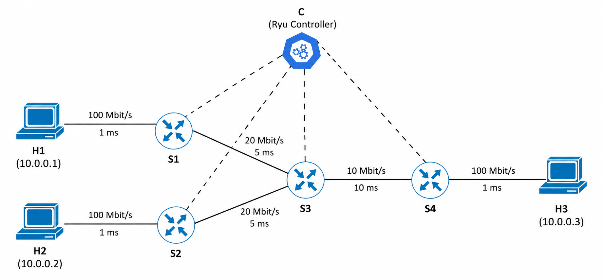

# NCIS - Rilevamento e mitigazione dinamica di attacchi DoS in reti SDN

Project Work per il corso **Network and Cloud Infrastructures (NCIS)**.

Il progetto realizza e valida, in ambiente SDN, un meccanismo progressivo di **monitoring, detection e mitigation di un attacco DoS**.  
La rete è emulata con **Mininet**, gli switch sono implementati tramite **Open vSwitch**, mentre il controllo è affidato a **Ryu** tramite **OpenFlow 1.3**.

## Topologia



Lo scenario utilizza:

- `h1` come host che genera il traffico UDP anomalo;
- `h2` come client legittimo;
- `h3` come server;
- `s3-s4` come collegamento condiviso e collo di bottiglia della rete.

Il link `s3-s4` è limitato a **10 Mbit/s**, mentre `h1` genera traffico UDP a **15 Mbit/s** verso `h3`.

## Struttura del progetto

```text
.
├── topology.py
├── controller_base.py
├── controller_monitoring.py
├── controller_detection.py
├── controller_mitigation.py
├── controller_dynamic_mitigation.py
├── comandi_mininet.txt
├── topologia.png
├── relazione.pdf
└── README.md
```

### File principali

- **`topology.py`**  
  Definisce la topologia Mininet, gli host, gli switch OpenFlow 1.3 e le caratteristiche dei link.

- **`controller_base.py`**  
  Implementa il learning switch di base e costituisce lo scenario senza protezione.

- **`controller_monitoring.py`**  
  Aggiunge il monitoraggio periodico delle porte tramite statistiche OpenFlow.

- **`controller_detection.py`**  
  Introduce la detection tramite soglia di throughput (`12 Mbit/s`) e la generazione dell'allarme.

- **`controller_mitigation.py`**  
  Aggiunge la remediation automatica installando una regola OpenFlow di drop con priorità elevata.

- **`controller_dynamic_mitigation.py`**  
  Estende la mitigation con:
  - rilevamento su più campioni consecutivi;
  - sblocco automatico quando il traffico torna stabilmente sotto soglia.

- **`comandi_mininet.txt`**  
  Contiene la **procedura completa e ordinata di esecuzione dei test**, con:
  - avvio dei controller;
  - avvio della topologia;
  - baseline;
  - DoS senza protezione;
  - monitoring;
  - detection;
  - mitigation;
  - dynamic mitigation;
  - verifica delle flow table;
  - pulizia dell'ambiente.

- **`relazione.pdf`**  
  Contiene la descrizione completa dell'architettura, delle scelte progettuali, delle versioni dei controller e dei risultati sperimentali.

## Evoluzione dei controller

Lo sviluppo è organizzato in cinque versioni progressive:

```text
Base
  ↓
Monitoring
  ↓
Detection
  ↓
Mitigation
  ↓
Dynamic Mitigation
```

La versione finale utilizza:

```text
THRESHOLD_MBPS = 12.0
ATTACK_SAMPLES = 3
RECOVERY_SAMPLES = 3
```

## Avvio rapido

Prima di una nuova prova:

```bash
sudo mn -c
```

In un primo terminale avviare il controller, ad esempio:

```bash
ryu-manager controller_base.py
```

In un secondo terminale avviare la topologia:

```bash
sudo python3 topology.py
```

Quando compare la CLI di Mininet:

```text
mininet>
```

è possibile verificare la connettività con:

```bash
pingall
```

Per eseguire **tutti i test nell'ordine corretto**, fare riferimento a:

```text
comandi_mininet.txt
```

## Scenario di attacco

Il traffico legittimo viene generato da `h2` verso `h3` tramite TCP.

L'attacco è generato da `h1` verso `h3` tramite UDP a 15 Mbit/s:

```bash
h1 iperf -c 10.0.0.3 -u -p 5002 -b 15M -t 40 &
```

La mitigation installa su `s1` una regola di drop con priorità 100.  
La regola può essere verificata con:

```bash
sh ovs-ofctl -O OpenFlow13 dump-flows s1
```

## Risultati principali

| Scenario | Throughput h2 | RTT medio | Packet loss |
|---|---:|---:|---:|
| Normale | 9.49 Mbit/s | 36.60 ms | 0% |
| DoS senza protezione | 0.0352 Mbit/s | 144.74 ms | 70% |
| DoS + mitigation | 9.49 Mbit/s | 35.98 ms | 0% |

I risultati mostrano una forte degradazione del traffico legittimo durante l'attacco e un recupero sostanzialmente completo dopo l'attivazione della mitigation.

## Documentazione

Per i dettagli completi su:

- topologia e configurazione dei link;
- funzionamento dei controller;
- calcolo del throughput;
- scelta della soglia;
- detection e mitigation;
- recovery automatico;
- risultati sperimentali;

fare riferimento a **`relazione.pdf`**.

Per riprodurre gli esperimenti passo per passo, utilizzare **`comandi_mininet.txt`**.
